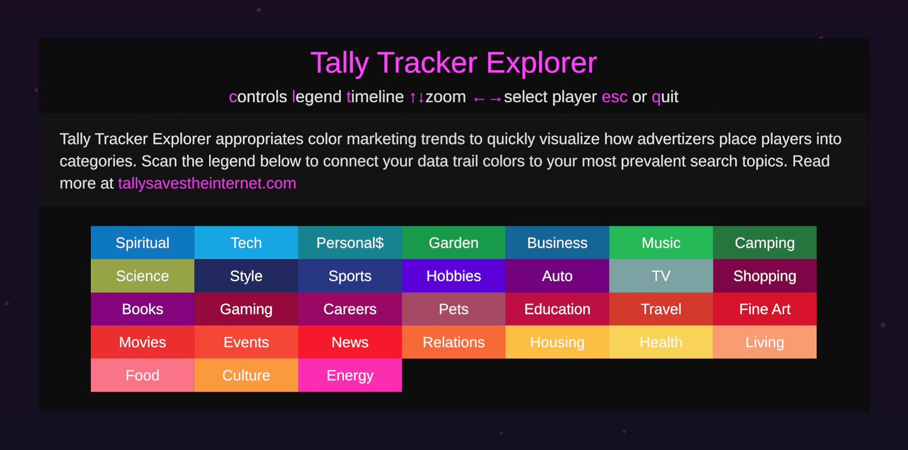

# Tally Tracker Explorer

- [About](#About)
- [About the data](#About-the-data)
- [Instructions](#Instructions)
	- [Running the application](#Running-the-application)
	- [Zoom-to-player instructions](#Zoom-to-player-instructions)
	- [Control panel options](#Control-panel-options)
- [Technology](#Technology)
	- [Display requirements](#Display-requirements)
- [Credits](#Credits)

### About

A visualization depicting live and archived game data from [Tally Saves the Internet](https://tallysavestheinternet.com) including player activity, achievements, and the trackers following them in real time.

> Tally Saves the Internet is a browser extension that transforms the data that advertisers collect into a multiplayer game. Once the browser extension is installed, a friendly pink blob named Tally lives in the corner of your screen and warns you when companies translate your human experiences into free behavioral data. When Tally encounters “product monsters” (online trackers and their corresponding product marketing categories) you can capture them in a turn-based battle (e.g. “Pokémon style”) transforming the game into a progressive tracker blocker, where you earn the right to be let alone through this playful experience.

Developed during COVID when people are increasingly online, Tally Tracker Explorer captures live data from Tally Saves the Internet and displays this data as a sea of avatars, each surrounded by small product monsters and attached to their unique data trails, colored to match their top marketing categories.

Both Tally Saves the Internet and Tally Tracker Explorer’s core goal is to visualize the internet and its trackers in a way that makes the invisible (trackers) visible and the lingo familiar. As Harvard Professor Shoshana Zuboff, if you can name the parts of a system, you can understand it. If you can understand it, you can push for change.

Sure it’s beautiful, but what does Tally Tracker Explorer tell me about anything? Tally Saves the Internet gives you much more accurate insights into how advertisers see you and gives you reminders about data tracking in the form of playful product monsters while you block trackers. What Tally Tracker Explorer does offer is a light-hearted visualization and collective spirit during this tough year of isolation, in and out of quarantine.

During COVID-19 quarantines, when we spend more time online, Tally Saves the Internet offers a way to reveal and re-envision the internet’s invisible structures as productive spaces for artistic interventions. As Klein and D’Agnozio describe in their 2020 book Data Feminism from MIT Press, if data is the new oil, those people who profit from this resource are thrilled while the rest of us range from indifferent to terrified. Tally offers its audience an alternative: it transforms advertising data into a multiplayer game that elevates emotion and alternative forms of embodiment as a way to examine power.

NC State’s [Immersive Scholar Project Page](https://osf.io/yve95/)

Tally Tracker Explorer on [Itch.io](https://sneakawaystudio.itch.io/tally-tracker-explorer)

## About the data

The anonymized data included in this project comes from player activity on [Tally Saves the Internet](https://tallysavestheinternet.com) as a way to visualize  how people are browsing the internet and being placed into the marketing categories by web trackers.

Each player is represented by their avatar floating through the sky with the following:
- Product monsters;
- Data trails (color from IAB Taxonomy);
- Player events, which include clicks, battles and badges from the game;
- Time span selected; and,
- A zoomed-in view of each player and some data (km scrolled and trackers blocked).

Don't know what a product monster is? See https://tallysavestheinternet.com/about

## Instructions

### Downloading and launching the application

- Go to [the project page on Itch.io](https://sneakawaystudio.itch.io/tally-tracker-explorer) and click the large Download Now at the bottom of the page.
- Double-click to unzip file.
- Double-click to launch application.

### Bypassing developer warning

If you see the warning above,
- Hit cancel.
- Go to System Preferences / General
- Where it says "...was blocked from use because it is not from an identified developer," click Open Anyway. 
- Next warning, click Open.

### Running the application

Open the application and it will start automatically. Pressing the following keys will open / close various panels:

- **C**ontrol panel - Settings and controls
- **L**egend panel - A reference for the marketing taxonomy
- **T**imeline panel - Shows the time of the event being played and size of the history and buffer
- **Q**uit or **ESC** - Exit the application

### Zoom-to-player instructions

operation | keyboard | gamepad  
--- | :-------------: | ---
zoom in | ↑ | left joystick ↑
select players | ← or → | left joystick ← or →  
zoom out | ↓ | left joystick ↓  

### Control panel options

- Player: View resolution, aspect ratio, FPS; Set `Resolution`, `Fullscreen`, and `Volume`
- Data: View `status`; Set `Source` and `Sample size` (stop, set `Source`, then start)
	- `live` - Fetch a live dataset once (using selected sample size), shuffle between buffer / history
	- `archive` - Same as `live` except it uses the archived data in the project (endpoint is disabled)
- Timeline: View `Status`, `History` and `Buffer` counts; Stop/Start the application.
- Details: View `Players` and `Events` counts, and `current event`; Toggle monsters on/off.

**NOTE**: Increase/decrease sample size in order to increase/decrease number of players

## Technology

### How it was built

- Visualization - Unity 2020.1.2f, Universal Render Pipeline (URP)
- Game API - Node/Express
- [More about our process](PROCESS.md)

### Display requirements

#### Suggested equipment

- Powerful computer (FAAAASST)
- High-quality display
- Fast internet connection
- Stereo speakers
- Control device like a wireless gamepad or keyboard

#### Responsive design

The visualization can adapt to any screen size. The project has been tested on the following devices:

device | OS | resolution | aspect ratio | specs | notes
--- | --- | --- | --- | --- | ---
Desktop | MacOS Catalina (10.15) | 3840 x 2160 | 16:9 | Mac Pro (2019)  | No issues
NCSU Immersion Theater | Windows 10 Pro 64 | 6816 x 2240 | 3.04:1 | Dell Precision T7910 , 128 Gb RAM, 2x Nvidia P5000 video cards2 x512 Gb SSD Hd") | ---
NCSU Game Lab | Windows 10 Pro 64 | 4800 x 1080 | 4.44:1 | Dell Precision T7910 , 1 TB SATA Hd") | ---
NCSU Visualization Studio | Windows | 15360 x 1080 | 12.52:1 | --- | Formerly (27053 x 2160). Remaining issues: what events correspond to lines in display? is audio mixed correctly? is Control panel completely visible?
iPad | iOS | 1536 x 2048 | 1.33 | iPad 3&4, Air 1&2, Mini 2&3 | ---

## Troubleshooting

If you select a non-native resolution in the control panel, the clickable of buttons may be misaligned. To fix, select resolution that matches your device.

If you encounter a security warning, see above under Installation.

## Credits

Created by [Sneakaway Studio](https://sneakaway.studio) (Joelle Dietrick and Owen Mundy) during an eight-week artist residency funded by the [Andrew Mellon Foundation](https://mellon.org/) through the [Immersive Scholar](https://www.immersivescholar.org/) program with the [NC State University Libraries](https://www.lib.ncsu.edu/).

Supported by weekly, then bi-weekly residency meetings with an invaluable NC State support team, namely Micah Vandegrift, Walt Gurley, Hannah Rainey, Scott Bailey, and Colin Keenan. We are particularly grateful for Micah's support of Joseph Dasilva as a studio assistant. His knowledge of Unity was invaluable.

Many thanks to everyone involved with the October 2nd, 2020 [Immersive Scholar Symposium: Data, Surveillance, and Privacy](https://www.lib.ncsu.edu/events/immersive-scholar-symposium-data-surveillance-and-privacy), hosted by NC State, especially Nick Merrill, Lauren Klein, Micah Vandegrift, Hannah Rainey, Ashley Evans Bandy, and Claire Cahoon.

## Contact

For general questions or troubleshooting questions contact [Walt Gurley](https://www.lib.ncsu.edu/staff/jwgurley). 
